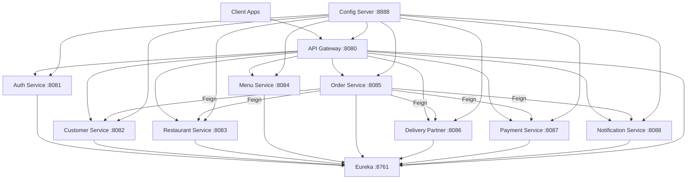

# Food Delivery Microservices Platform

Enterprise-grade food delivery backend (Zomato/Swiggy-style) built with **Java 17**, **Spring Boot 3.3**, **Spring Cloud**, **MySQL**, **JWT**, **Eureka**, **Config Server**, and **API Gateway**.

## Architecture Overview



## Microservices

| Service | Port | Database | Responsibility |
|---------|------|----------|----------------|
| discovery-server | 8761 | - | Service registry (Eureka) |
| config-server | 8888 | - | Centralized configuration |
| api-gateway | 8080 | - | Routing, load balancing |
| auth-service | 8081 | auth_db | JWT auth, RBAC |
| customer-service | 8082 | customer_db | Customer profiles |
| restaurant-service | 8083 | restaurant_db | Restaurant management |
| menu-service | 8084 | menu_db | Menu items & availability |
| order-service | 8085 | order_db | Order orchestration (Feign) |
| delivery-partner-service | 8086 | delivery_db | Delivery assignment & status |
| payment-service | 8087 | payment_db | Simulated payments |
| notification-service | 8088 | notification_db | Order notifications |

## Layered Architecture (per service)

```
controller → service → serviceImpl → repository
                ↓
         dto (Request/Response) ↔ mapper ↔ entity
                ↓
         config / security / exception
```

## Communication Flow

### 1. Customer Registration & Login
1. Create customer: `POST /api/customers` (via gateway)
2. Register auth: `POST /api/auth/register` with `role=CUSTOMER` and `referenceId={customerId}`
3. Login: `POST /api/auth/login` → receive JWT

### 2. Restaurant & Menu
1. Restaurant owner registers in auth with `role=RESTAURANT_OWNER`
2. Create restaurant: `POST /api/restaurants`
3. Add menu: `POST /api/menus`

### 3. Order Flow
1. Customer places order: `POST /api/orders`
2. Order Service (Feign):
   - Validates customer (`customer-service`)
   - Validates restaurant (`restaurant-service`)
   - Processes payment (`payment-service`)
   - Sends notifications (`notification-service`)

### 4. Delivery Flow
1. Assign partner: `POST /api/orders/{id}/assign-delivery`
2. Order Service calls `delivery-partner-service`
3. Update status: `PATCH /api/delivery-partners/{id}/status`  
   Statuses: `ASSIGNED` → `PICKED_UP` → `OUT_FOR_DELIVERY` → `DELIVERED`

### 5. Payment Flow
- Simulated in `payment-service` → `SUCCESS`

### 6. Notification Flow
- Triggered on: order placed, order accepted, order delivered

## Roles (RBAC)

- `ADMIN`
- `CUSTOMER`
- `RESTAURANT_OWNER`
- `DELIVERY_PARTNER`

## Prerequisites

- Java 17+
- Maven 3.8+
- MySQL 8 (or use `docker-compose up -d`)

## Run with Docker (recommended — no port conflicts)

Run **all 12 services** in containers. Host ports: **8080, 8761, 8888, 3307** (MySQL uses 3307 if you already have MySQL on 3306).

```bash
chmod +x docker-start.sh
./docker-start.sh
```

Full guide: **[DOCKER.md](DOCKER.md)**  
**Swagger testing:** **[SWAGGER-TESTING.md](SWAGGER-TESTING.md)** — http://localhost:8080/swagger-ui.html (after `docker compose build && docker compose up -d`)

## Quick Start (local Maven)

### 1. Start MySQL
```bash
docker compose up -d mysql
```

### 2. Build project
```bash
./mvnw clean install -DskipTests
```

### 3. Start services (order matters)
```bash
./mvnw -pl discovery-server spring-boot:run
./mvnw -pl config-server spring-boot:run
./mvnw -pl auth-service,customer-service,restaurant-service,menu-service,payment-service,notification-service,delivery-partner-service,order-service spring-boot:run
./mvnw -pl api-gateway spring-boot:run
```

Run each service in a separate terminal, or use your IDE.

### 4. Access APIs
- **Gateway**: http://localhost:8080
- **Eureka Dashboard**: http://localhost:8761
- **Swagger (per service)**: http://localhost:{port}/swagger-ui.html

## Sample API Endpoints (via Gateway)

| Method | Endpoint | Description |
|--------|----------|-------------|
| POST | `/api/auth/register` | Register user |
| POST | `/api/auth/login` | Login & JWT |
| POST | `/api/customers` | Create customer |
| GET | `/api/customers/{id}` | Get customer |
| POST | `/api/restaurants` | Create restaurant |
| POST | `/api/menus` | Add menu item |
| GET | `/api/menus/restaurant/{id}` | Menu by restaurant |
| POST | `/api/orders` | Place order |
| POST | `/api/orders/{id}/assign-delivery` | Assign delivery |
| POST | `/api/payments/process` | Process payment |
| POST | `/api/notifications` | Send notification |
| POST | `/api/delivery-partners/assign` | Assign partner |

## Example: End-to-End Order

```bash
# 1. Create customer
curl -X POST http://localhost:8080/api/customers \
  -H "Content-Type: application/json" \
  -d '{"name":"John","email":"john@mail.com","phone":"9876543210","address":"Mumbai"}'

# 2. Register & login
curl -X POST http://localhost:8080/api/auth/register \
  -H "Content-Type: application/json" \
  -d '{"email":"john@mail.com","password":"secret1","role":"CUSTOMER","referenceId":1}'

# 3. Create restaurant & menu, then place order
curl -X POST http://localhost:8080/api/orders \
  -H "Content-Type: application/json" \
  -d '{"customerId":1,"restaurantId":1,"totalAmount":499.0,"paymentMethod":"UPI"}'
```

## Project Structure

```
food-delivery-platform/
├── common-lib/              # Shared enums, exceptions, error DTOs
├── config-repo/             # Centralized YAML configs
├── discovery-server/
├── config-server/
├── api-gateway/
├── auth-service/
├── customer-service/
├── restaurant-service/
├── menu-service/
├── order-service/           # Feign orchestration
├── delivery-partner-service/
├── payment-service/
├── notification-service/
├── docker-compose.yml
└── pom.xml
```

## Technology Stack

- Java 17, Spring Boot 3.3.5, Spring Cloud 2023.0.3
- Spring Data JPA, MySQL, Spring Security, JWT (jjwt)
- OpenFeign, Eureka, Spring Cloud Config, API Gateway
- Lombok, Jakarta Validation, SpringDoc OpenAPI

## Configuration

- Default MySQL: `root/root` @ `localhost:3306`
- JWT secret & DB settings: `config-repo/application.yml`
- Override locally via `application.yml` in each service

## Documentation (PDF)

A full technical guide for review and learning is available at:

- **PDF:** [`docs/Food-Delivery-Platform-Documentation.pdf`](docs/Food-Delivery-Platform-Documentation.pdf)
- **Microservices learning PDF:** [`docs/Microservices-Learning-Guide.pdf`](docs/Microservices-Learning-Guide.pdf) — concepts mapped to this project
- **HTML:** [`docs/Food-Delivery-Platform-Documentation.html`](docs/Food-Delivery-Platform-Documentation.html)

Regenerate after changes: `python3 docs/generate_documentation_pdf.py`

## Notes

- APIs use **RequestDto/ResponseDto** only — entities never exposed
- Inter-service calls use **Feign + DTOs** only
- **Constructor injection** used throughout (no field injection)
- **BCrypt** password encoding in auth-service
- Services are **loosely coupled** with separate databases per bounded context
